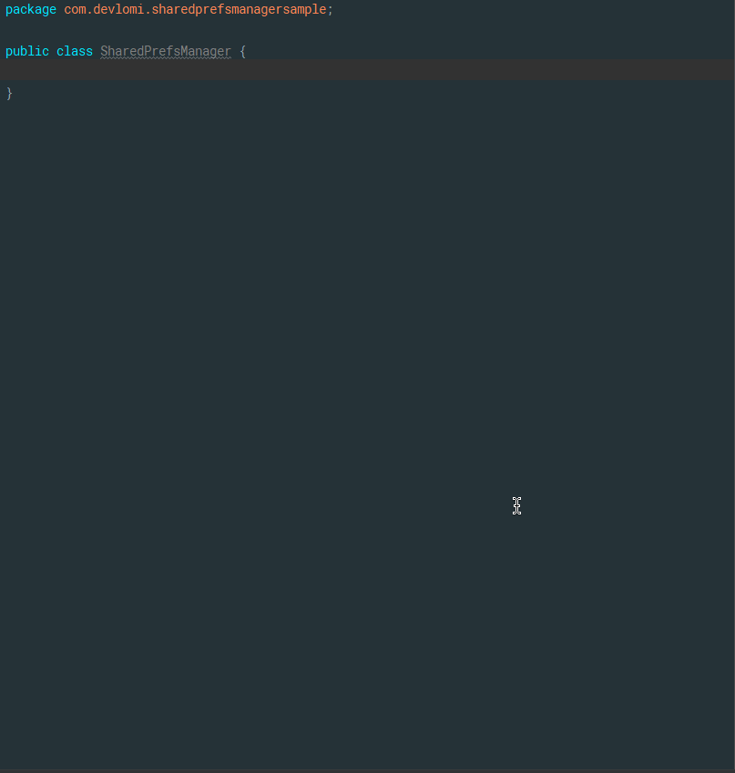

# SharedPrefsManager
A plugin that Generates SharedPreferences methods for you


## Demo
<p align="center">
  
</p>


## Getting Started
1. Download and Install the plugin
2. Create a new Class then Generate the methods by going to `Generate -> Generate SharedPrefs`
3. add the fields you want in the Dialog then click on 'Generate' to generate the required methods
4. Create an `Application` Subclass and call the method `init()` inside `onCreate()`
```java
public class MyApp extends Application{
    @Override
    public void onCreate() {
        super.onCreate();
        SharedPrefsManager.init(this);
    }
}
```
5. now you can call the SharedPrefs methods from any class(Activity,Fragment,etc..) inside your Application


```
   Copyright 2018 AbdulAlim Rajjoub

   Licensed under the Apache License, Version 2.0 (the "License");
   you may not use this file except in compliance with the License.
   You may obtain a copy of the License at

       http://www.apache.org/licenses/LICENSE-2.0

   Unless required by applicable law or agreed to in writing, software
   distributed under the License is distributed on an "AS IS" BASIS,
   WITHOUT WARRANTIES OR CONDITIONS OF ANY KIND, either express or implied.
   See the License for the specific language governing permissions and
   limitations under the License.
```
